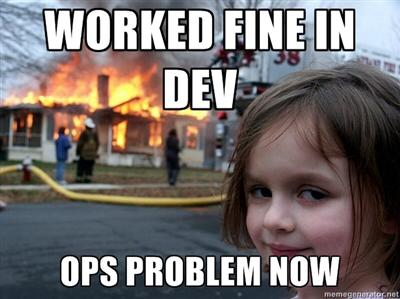
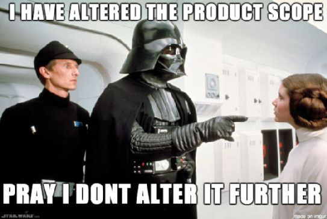
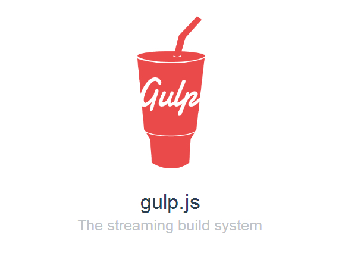

# JavaScript Build Tools
By [Ryan Kotzen | @eXigentCoder](https://twitter.com/eXigentCoder)

Information on the JavaScript build ecosystem.


Writing your own code/module is cool and all, but I'm pretty lazy, can't I reuse other peoples code? What if I would like to publish my own code so that it can be reused in future projects?

* * *

# Introducing [Node Package Manager (NPM)](https://docs.npmjs.com/getting-started/what-is-npm)!


NPM comes bundled with your node install and is now [the largest package registry in the world!](https://developers.slashdot.org/story/17/01/14/0222245/nodejss-npm-is-now-the-largest-package-registry-in-the-world)
* * *
## Installing Packages


Once you have found the package you are looking for using something like [npms](npms.io) or [npmjs](npmjs.com) simply install it by typing:
> `npm install <nameOfDependency>` or `npm i <nameOfDependency>`

You can also search for packages using the cli itself:
> `npm search [searchTerms]`

You can also install a dependency at a specific version:
> `npm install <nameOfDependency>@<semVer>`

Once the install is finished, you will see you now have a `node_modules` folder in the route of your project. This is where all node dependencies live. This folder can get quite large so you don't want to check it in.

> But if I shouldn't check in my `node_modules` folder, how do my team members/ci-server/cd-server know what dependencies to use?

Enter the `package.json` file! This is a simple file that tracks our dependencies, their versions and does a fair bit of other awesome stuff that we will get into later. We could create this file manually for us, but there is a built in utility to do it, `npm init`. Before we run this command, lets tell npm a bit about ourselves.

* * *

## Create your `package.json` file


Go ahead and type:

> npm init

Follow the onscreen wizard. You should now have a `package.json` file, yay! Go ahead and install moment

> e.g. `npm i moment`

You will notice nothing in your package.json file changed ... oops. This is because by default, `npm i` does not save to your `package.json` file, you need to add the flag `--save` So the full version of the command would be:

> e.g. `npm i moment --save`

Your `package.json` file will now have something like
```
"dependencies": {
  "moment": "^2.18.1"
}
```

That `^` symbol you see there is [semver wilcard](https://docs.npmjs.com/misc/semver). If people understood semver specifying a wildcard string would allow your app to stay fairly up to date automatically ... but humans do not understand semver, so please, do not use wildcards in your projects. Always check in the exact version string, npm has a useful flag to do this, `--save-exact` making our full install command:

> `npm i moment --save --save-exact`

This works but is a bit long, so we can simply change our global and/or local .npmrc file to have the following two lines:

```
save=true
save-exact=true
```

You can also do the above by running commands:
* `npm config set save true`
* `npm config set save-exact true`

Allowing us once again to simply type

> e.g. `npm i moment`

Note that you can also install multiple dependencies at the same time. E.g.:

> e.g. `npm i moment lodash express`

This is all good and well, but how do I use a dependency once it has been installed?
See index.js

* * *

## Set up your npm defaults

> Source: http://iamsim.me/set-your-npm-init-defaults/

* `npm config set init.author.name "Ryan Kotzen"`
* `npm config set init.author.email potz666@gmail.com`
* `npm config set init.author.url http://blog.exigentcoder.com`
* `npm config set init.license MIT`

These generally get saved to your `<userFolder>/.npmrc` file. You may also notice that this project has its own `.npmrc` file which will override your user settings. For more info, [see this page](https://docs.npmjs.com/files/npmrc).

* * *

## Uninstalling Packages


Sometimes things go wrong or you stop using a component and need it removed. This command also observes the save flag stored in `.npmrc`
> `npm uninstall <nameOfDependency>`

* * *
## Dev Dependencies



Add the --save-dev flag e.g. `npm i mocha --save-dev`. This is for the packages you use during dev/ci/cd but which do not get installed to production. Examples include linting and testing.

* * *

## Shrinkwrap - make mine to go!


> Note that this is only required when using an npm version lower than 5.x. Newer versions use a package-lock.json file.

Once you are ready to deploy your app type `npm shrinkwrap` and this will freeze all of your dependencies, and their dependencies, and their dependencies, and their dependencies, etc and write it to the `npm-shrinkwrap.json` file in the root of your app. When your server hosting node does a `npm install`, this file will be used to install the exact dependencies you had on your dev/ci/cd box.

* * *
## Global modules


Add the -g flag e.g. `npm i loadtest -g`. Often times this will add a new .cmd or bash command, hence why it should be in your path variables.

On Windows these get installed to `%USERPROFILE%\AppData\Roaming\npm`
The linux location depends on if you are using `nvm` or not.

Often an **anti-pattern** so ensure you are using this correctly.

* * *
## Scripts


`npm run <nameOfScript>` - Runs a script defined in your package.json. No need for gulp/grunt!
For example in your `package.json` :

```
{
    ...
    "scripts":{
        ...
        "lint": "node_modules/.bin/eslint \"src/**/*.js\" \"test/**/*.js\" index.js --fix"
    }
}
```

Then to execute it :
> `npm run lint`

JavaScript is interpreted, not compiled so but sometimes you still want a "build" phase of the application. So what sorts of tasks would we want to run?
The logic for what your CI/CD server does should be checked into source control, tasks are ideal for this.

* Minification
* Obfuscation
* File concatenation
* Transpile - Convert from a newer version of ES to an earlier one for browser/Node compatibility
* Optimisation
* Check for errors (Lint)
* Format code (Prettier)
* Run an application
* Watch files for changes and then kick off another task such as reboot application
* Run automated tests (Unit, integration, performance, etc.)
* Get code coverage
* Publish (to NPM registry)
* Deploy to an environment
* Generate a code complexity report
* Run any miscellaneous/arbitrary script or binary
* Update dependencies
* Check dependencies for vulnerabilities (Snyk)
* Code generation
* Data generation

* * *
## Extra commands


* `npm outdated` - list outdated packages.
* `npm update` - Update packages, see the `npm-check` package.
* `npm dedupe` - Removes duplicate packages from the node-modules folder based on wildcards. See https://docs.npmjs.com/cli/dedupe.
* `npm link` - Used for modules development, allows you to link a specific module to a folder on your pc.
* `npm prune --production` - Removes dev dependencies.
* `npm t` | `npm test` - Runs the test command specified in your scripts of your package.json.

* * *

## Versioning


The `package.json` file is used to keep track of the version number of your project/module. This version number will be used when publishing to the NPM registry. There is a useful command for incrementing this version number from the cli. This is great for use with a build/CI server.

> `npm version [<newversion> | major | minor | patch | premajor | preminor | prepatch | prerelease | from-git]` 

If you run the above command in a directory that is a git repo it will also create a git tag for you (excluding the from-git option) so that it's easy to tie up the npm version to the git version.

* * *

## Publishing to NPM


If you find you have a module you would like to publish to NPM either publicly or privately this is fairly straight forward.

1. Find out if you are already logged in on your CLI
    > `npm whoami`
1. If you aren't logged in as the user you want to publish as you can logout first
    > `npm logout` 
1. To login, type:
    > `npm adduser`
    
    You will need to provide your npm username, password an email address. You can create an account by registering on the [NPM Site](https://www.npmjs.com/signup)
1. When you are ready to publish your package, open a terminal window in the root directory of the project where your `package.json` file is and type
    > `npm publish`
1. If you accidentally published, you can remove that by typing
    > `npm unpublish`

* * *
# Scoped packages



You can use a specific named scope to refer to a pacakge, this is usually a username/organisation name. It helps group packages together and helps prevent people from accidentally installing a malicious third party package. To do so, you simply need to add the scope before the package name wherever you are using it e.g.
* "name": "@encentivize/presentation-node-build-tools"
* `npm install @encentivize/presentation-node-build-tools`
* ``` 
    "dependencies": {
       "@encentivize/presentation-node-build-tools": "0.0.1"
     }
    ```
* `require('@encentivize/presentation-node-build-tools')`

You can also associate a scope with a specific registry to make publishing to different registries easier

* * *
# Yarn

I heard Facebook released their own package manger, Yarn, can I use that too? Yup, simply do a `yarn add <nameOfDependency>`. 

[ ](https://yarnpkg.com/en/)

* * *
# Grunt


> Not recommended for new projects
 
See the Gruntfile.js in the root

* * *
# Gulp

> Not recommended for new projects

See the gulpfile.js in the root